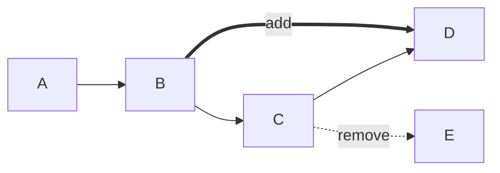

# 03_算法集成与执行流程

## 算法集成架构

### 1. 算法模型与业务模型分离

#### 核心设计原则
```text
算法模型 (ProcessMap/MultiNode/ProcessPath)  ⇌ 业务模型 (Entity/DTO/VO)
     ↑                                        ↑
     |                                        |
  算法包(algorithm)                      数据库层(persistence)
     |                                        |
  优化计算                              数据持久化
```

**为什么这样设计？**
- **算法包频繁变更**: 算法逻辑迭代快，不应影响数据库Schema
- **计算逻辑隔离**: 算法模型包含计算逻辑，不适合直接持久化
- **解耦领域**: 业务领域(流程图管理)与算法领域(优化计算)分离

### 2. 算法模型定义

#### ProcessMap (流程图算法模型)
```java
package com.example.optimization_algorithm_backend.algorithm.model;

public class ProcessMap {
    private String processMapID;
    private List<MultiNode> multiNodes;           // 节点集合
    private LinkedList<ProcessPath> processPaths; // 路径集合
    private List<ConstraintCondition> constraintConditions; // 约束条件
    private List<Equipment> equipments;           // 装备集合
    private int totalTime;                        // 总时间
    private double totalPrecision;                // 总精度
    private int totalCost;                        // 总成本
}
```

#### MultiNode (多节点算法模型)
```java
public class MultiNode {
    private String nodeID;          // 节点编码
    private String nodeDescription; // 节点描述
    private String equipmentName;   // 装备名称
    private int time;               // 时间成本
    private double precision;       // 精度值
    private int cost;               // 成本值
}
```

## 数据转换机制

### 1. ProcessMapConverter 核心转换器

#### 数据库实体 → 算法模型
位于 `ProcessMapConverter.java` 的核心转换流程包含以下步骤：

**步骤1 - 创建算法模型**: `ProcessMap processMap = new ProcessMap();`

**步骤2 - 转换节点**: 将 `ProcessNodeEntity` 列表转换为 `MultiNode` 列表
- 通过 `equipmentId` 关联装备名称
- 复制时间、精度、成本等属性

**步骤3 - 转换路径**: 将 `ProcessPathEntity` 列表转换为 `ProcessPath` 列表
- 映射起点和终点节点ID

**步骤4 - 转换约束**: 将 `ConstraintConditionEntity` 列表转换为 `ConstraintCondition` 列表
- 复制约束类型和描述

**步骤5 - 转换装备**: 将 `EquipmentEntity` 列表转换为 `Equipment` 列表
- 复制装备属性

**步骤6 - 设置统计值**: 从 `FlowGraphEntity` 复制总时间、总精度、总成本

#### 关键转换逻辑：节点与装备关联
节点实体存储的是 `equipment_id`（外键），而算法模型需要 `equipmentName`（字符串）。转换器需要：
1. 查找节点对应的装备实体
2. 提取装备名称
3. 设置到MultiNode中

### 2. 算法模型 → InputInfo 转换

#### 执行前的最后准备
在执行算法之前，需要将ProcessMap转换为算法包需要的InputInfo格式：

```java
private InputInfo toInputInfo(ProcessMap processMap, int[] factors) {
    ArrayList<ProcessNode> processNodes = new ArrayList<>();
    
    // MultiNode → ProcessNode 转换
    if (processMap.getMultiNodes() != null) {
        for (MultiNode node : processMap.getMultiNodes()) {
            processNodes.add(new ProcessNode(
                node.getNodeID(),
                node.getNodeDescription(),
                node.getEquipmentName(),
                node.getTime(),
                node.getPrecision(),
                node.getCost()
            ));
        }
    }
    
    return new InputInfo(
        processNodes,
        copyConstraints(processMap.getConstraintConditions()),
        copyPaths(processMap.getProcessPaths()),
        copyEquipments(processMap.getEquipments()),
        factors
    );
}
```

## 算法执行链路

### 1. 完整执行流程

#### 执行流程图
```text
开始执行
  ↓
加载任务 (getOptimizeTaskMapper().selectById(taskId))
  ↓
校验任务状态 (PENDING/RUNNING)
  ↓
标记为运行中 (markTaskRunning(taskId))
  ↓
构建优化上下文 (buildContext(taskId))
  ├── 加载流程图实体 (flowGraph)
  ├── 加载节点列表 (processNode)
  ├── 加载路径列表 (processPath)
  ├── 加载装备列表 (equipment)
  └── 加载约束列表 (constraintCondition)
  ↓
转换为算法模型 (ProcessMapConverter.toProcessMap())
  ↓
创建输入信息 (toInputInfo())
  ↓
执行算法 (runAlgorithm())
  ├── 算法类型判断 (switch algorithmType)
  ├── 初始化算法 (algorithm.initAlgorithm())
  ├── 获取优化结果 (algorithm.OptimizeMap())
  └── 计算评价指标 (algorithm.getValue())
  ↓
生成简化Diff (buildSimplifiedDiff())
  ↓
构建结果图 (buildResultGraph())
  ↓
计算综合评分 (calculateScoreRatio())
  ↓
持久化成功结果 (persistSuccess())
  └── 更新任务状态为SUCCESS
  └── 保存优化结果到数据库
  └── 缓存优化结果到Redis
```

### 2. 算法选择策略

#### 三选一算法执行
系统支持三种优化算法，通过 `algorithmType` 参数选择：

```java
switch (context.task.getAlgorithmType()) {
    case 1:  // Algorithm1
        Algorithm1 algorithm1 = new Algorithm1();
        algorithm1.initAlgorithm(map1);
        ProcessMap map2 = algorithm1.getOptimizationMap(map1, mode);
        ProcessMap map3 = utils.restoreProcessMap(map2);
        optimizedMap = algorithm1.OptimizeMap(map3, context.factors, mode);
        values = algorithm1.getValue(optimizedMap);
        break;
    case 2:  // Algorithm2
        // 类似Algorithm1的执行流程
        break;
    case 3:  // Algorithm3  
        // 类似Algorithm1的执行流程
        break;
    default:
        throw new BusinessException(ErrorCode.PARAM_INVALID, "algorithmType仅支持1/2/3");
}
```

**算法参数说明**:
- **algorithmType**: 1/2/3，选择不同优化算法
- **algorithmMode**: 子模式参数，影响算法行为
- **factors**: [时间权重, 精度权重, 成本权重]，影响综合评分计算

### 3. 结果比较与Diff生成

#### 路径对比分析
优化前后需要对比路径变化，识别新增和删除的路径：

```java
// 对比优化前后的路径差异
LinkedList<ProcessPath> oldPaths = copyPaths(context.sourceSnapshot.getProcessPaths());
LinkedList<ProcessPath> newPaths = copyPaths(optimizedMap.getProcessPaths());

// 使用Main.compareMapPaths进行对比
Map<String, Object> pathDiff = Main.compareMapPaths(oldPaths, newPaths);
```

**对比输出结构**:
```json
{
  "addPath": [  // 新增的路径
    {"start": "A", "end": "B"}
  ],
  "removePath": [  // 删除的路径
    {"start": "C", "end": "D"}
  ]
}
```

#### 指标对比分析
提取优化前后的时间、精度、成本指标：

```java
// 提取优化前后的指标值
int beforeTime = extractMetricInt(values, "oldValue", "time", context.sourceSnapshot.getTotalTime());
double beforePrecision = extractMetricDouble(values, "oldValue", "precision", context.sourceSnapshot.getTotalPrecision());
int beforeCost = extractMetricInt(values, "oldValue", "cost", context.sourceSnapshot.getTotalCost());

int afterTime = extractMetricInt(values, "newValue", "time", optimizedMap.getTotalTime());
double afterPrecision = extractMetricDouble(values, "newValue", "precision", optimizedMap.getTotalPrecision());
int afterCost = extractMetricInt(values, "newValue", "cost", optimizedMap.getTotalCost());
```

### 4. 简化版Diff生成

#### 构建用户友好的Diff结构
原始的pathDiff结构较为底层，需要转换为前端友好的格式：

```java
private Map<String, Object> buildSimplifiedDiff(Map<String, Object> pathDiff,
                                                int beforeTime,
                                                double beforePrecision,
                                                int beforeCost,
                                                int afterTime,
                                                double afterPrecision,
                                                int afterCost) {
    
    Map<String, Object> diff = new HashMap<>();
    
    // 1. 路径差异
    List<Map<String, String>> addedPaths = extractPaths(pathDiff, "addPath");
    List<Map<String, String>> removedPaths = extractPaths(pathDiff, "removePath");
    diff.put("addedPaths", addedPaths);
    diff.put("removedPaths", removedPaths);
    
    // 2. 指标差异
    Map<String, Object> metricDiff = new HashMap<>();
    metricDiff.put("time", metricDiffItem(beforeTime, afterTime));
    metricDiff.put("precision", metricDiffItem(beforePrecision, afterPrecision));
    metricDiff.put("cost", metricDiffItem(beforeCost, afterCost));
    diff.put("metricDiff", metricDiff);
    
    return diff;
}
```

**最终Diff结构**:
```json
{
  "addedPaths": [
    {"fromNodeCode": "A", "toNodeCode": "B"}
  ],
  "removedPaths": [
    {"fromNodeCode": "C", "toNodeCode": "D"}
  ],
  "metricDiff": {
    "time": {"before": 120, "after": 100, "change": -20},
    "precision": {"before": 0.8100, "after": 0.8700, "change": 0.0600},
    "cost": {"before": 300, "after": 260, "change": -40}
  }
}
```

## 结果持久化与可视化

### 1. 优化结果持久化

#### OptimizeResultEntity 结构设计
优化结果保存在 `optimize_result` 表中，包含以下核心字段：

- **taskId**: 关联任务ID，建立任务与结果的关系
- **resultGraphJson**: 优化后的流程图快照，JSON格式
- **diffJson**: 简化版Diff信息，便于前端展示
- **mapCode**: Mermaid图代码，支持可视化渲染
- **totalTimeBefore/After**: 优化前后的时间指标
- **totalPrecisionBefore/After**: 优化前后的精度指标
- **totalCostBefore/After**: 优化前后的成本指标
- **scoreRatio**: 综合评分，反映优化效果

#### 结果保存流程
```java
private void persistSuccess(OptimizeContext context, AlgorithmOutput output) {
    try {
        OptimizeResultEntity result = new OptimizeResultEntity();
        result.setTaskId(context.task.getId());
        result.setWorkspaceId(context.task.getWorkspaceId());
        result.setSourceGraphId(context.task.getGraphId());
        result.setResultName("优化结果-" + context.task.getTaskNo());
        result.setResultGraphJson(objectMapper.writeValueAsString(output.resultGraph));
        result.setDiffJson(objectMapper.writeValueAsString(output.diff));
        result.setMapCode(output.mapCode);
        result.setTotalTimeBefore(output.beforeTime);
        result.setTotalPrecisionBefore(BigDecimal.valueOf(output.beforePrecision).setScale(4, RoundingMode.HALF_UP));
        result.setTotalCostBefore(output.beforeCost);
        result.setTotalTimeAfter(output.afterTime);
        result.setTotalPrecisionAfter(BigDecimal.valueOf(output.afterPrecision).setScale(4, RoundingMode.HALF_UP));
        result.setTotalCostAfter(output.afterCost);
        result.setScoreRatio(output.scoreRatio);
        
        getOptimizeResultMapper().insert(result);
        optimizeTaskStateService.markSuccess(context.task.getId(), result.getId());
        
        // 缓存结果
        OptimizeResultVO resultVO = convertToVO(result, output);
        optimizeTaskCacheService.cacheOptimizeResult(context.task.getId(), resultVO);
        
    } catch (Exception ex) {
        persistFailure(context.task.getId(), ex);
    }
}
```

### 2. Mermaid图代码生成

#### 可视化流程图生成
使用算法包的 `Main.WriteMapCode` 方法生成Mermaid代码：

```java
String mapCode = Main.WriteMapCode(optimizedMap, pathDiff);
```

**生成的Mermaid代码示例**:


**Mermaid图优势**:
- **标准可视化**: 生成标准Mermaid代码，前端可直接渲染
- **差异高亮**: `== add ==>` 表示新增，`-. remove .->` 表示删除
- **可交互**: 支持前端交互式流程图展示

### 3. 综合评分计算

#### 评分算法实现
综合评分反映了优化效果，考虑时间、精度、成本三个维度的改进：

```java
private BigDecimal calculateScoreRatio(int beforeTime,
                                       double beforePrecision,
                                       int beforeCost,
                                       int afterTime,
                                       double afterPrecision,
                                       int afterCost,
                                       int[] factors) {
    
    // 归一化权重
    int sum = factors[0] + factors[1] + factors[2];
    if (sum <= 0) {
        sum = 1;
    }
    double wTime = (double) factors[0] / sum;
    double wPrecision = (double) factors[1] / sum;
    double wCost = (double) factors[2] / sum;
    
    // 计算各部分改进率
    double timePart = beforeTime <= 0 ? 0D : (double) (beforeTime - afterTime) / beforeTime;
    double precisionPart = afterPrecision - beforePrecision;  // 精度是越大越好
    double costPart = beforeCost <= 0 ? 0D : (double) (beforeCost - afterCost) / beforeCost;
    
    // 加权综合评分
    double ratio = timePart * wTime + precisionPart * wPrecision + costPart * wCost;
    
    return BigDecimal.valueOf(ratio).setScale(6, RoundingMode.HALF_UP);
}
```

**评分公式**:
```
综合评分 = (时间改进率 × 时间权重 + 精度改进量 × 精度权重 + 成本改进率 × 成本权重) / 总权重
```

**评分意义**:
- **正数**: 优化效果正面
- **负数**: 优化效果负面
- **零**: 无明显变化
- **评分范围**: 通常[-1, 1]，根据权重可超出

## 异常处理与错误恢复

### 1. 算法执行异常处理

#### 异常捕获与持久化
算法执行过程中可能出现各种异常，需要妥善处理：

```java
private void executeTask(Long taskId) {
    try {
        markTaskRunning(taskId);
        OptimizeContext context = buildContext(taskId);
        AlgorithmOutput output = runAlgorithm(context);
        persistSuccess(context, output);
        
    } catch (Exception ex) {
        // 异常处理
        persistFailure(taskId, ex);
    }
}
```

#### 失败信息记录
失败时需要记录详细的错误信息，便于问题排查：

```java
private void persistFailure(Long taskId, Exception ex) {
    optimizeTaskStateService.markFailed(taskId, 
        "TASK_EXECUTION_FAILED", 
        truncate(ex.getMessage(), 1000));  // 截断过长错误信息
}
```

**错误信息截断策略**:
- **最大长度**: 1000字符
- **截断处理**: 保留前1000字符，避免存储过大错误堆栈
- **关键信息**: 优先保留异常类型和核心错误信息

### 2. 数据转换异常处理

#### 转换过程中的异常防御
数据转换过程中可能出现数据不一致或格式错误：

```java
private MultiNode toMultiNode(ProcessNodeEntity node, List<EquipmentEntity> equipments) {
    try {
        // 正常转换逻辑
        return convertNode(node, equipments);
    } catch (Exception ex) {
        log.warn("节点转换失败: nodeId={}, error={}", node.getId(), ex.getMessage());
        
        // 创建默认节点，避免流程中断
        MultiNode defaultNode = new MultiNode();
        defaultNode.setNodeID(node.getNodeCode());
        defaultNode.setNodeDescription("转换失败：" + node.getNodeDescription());
        return defaultNode;
    }
}
```

**异常处理原则**:
- **不影响主流程**: 转换失败创建默认值，而不是抛出异常
- **记录日志**: 记录详细的错误信息便于排查
- **优雅降级**: 允许部分数据转换失败，继续执行剩余流程

## 性能优化考虑

### 1. 数据预加载优化

#### 批量数据加载策略
为减少数据库查询次数，采用批量加载策略：

```java
private OptimizeContext buildContext(Long taskId) {
    // 1. 加载任务
    OptimizeTaskEntity task = getOptimizeTaskMapper().selectById(taskId);
    
    // 2. 批量加载关联数据
    FlowGraphEntity graph = getFlowGraphMapper().selectById(task.getGraphId());
    
    // 3. 使用单个查询条件加载所有子数据
    LambdaQueryWrapper<ProcessNodeEntity> nodeQuery = new LambdaQueryWrapper<ProcessNodeEntity>()
        .eq(ProcessNodeEntity::getGraphId, graph.getId())
        .orderByAsc(ProcessNodeEntity::getSortNo)
        .orderByAsc(ProcessNodeEntity::getId);
    List<ProcessNodeEntity> nodes = getProcessNodeMapper().selectList(nodeQuery);
    
    // 类似方式加载其他数据...
    
    return new OptimizeContext(task, graph, sourceMap, sourceSnapshot, factors);
}
```

**优化效果**:
- **减少查询次数**: 从多次单条查询改为批量查询
- **排序预处理**: 数据库层面排序，减少内存排序开销
- **连接复用**: 使用同一graphId条件，可利用数据库连接池优化

### 2. 对象拷贝优化

#### 深拷贝与浅拷贝策略
算法执行需要修改数据，为避免影响原始数据，需要进行拷贝：

```java
private ProcessMap deepCopyProcessMap(ProcessMap source) {
    // 创建新对象，但复用内部数据结构（浅拷贝）
    ProcessMap copy = new ProcessMap(
        "copy_" + System.nanoTime(),
        copyNodes(source.getMultiNodes()),      // 深拷贝节点
        copyPaths(source.getProcessPaths()),    // 深拷贝路径
        copyConstraints(source.getConstraintConditions()),  // 深拷贝约束
        copyEquipments(source.getEquipments())  // 深拷贝装备
    );
    
    // 复制统计值（基本类型，直接复制）
    copy.setTotalTime(source.getTotalTime());
    copy.setTotalPrecision(source.getTotalPrecision());
    copy.setTotalCost(source.getTotalCost());
    
    return copy;
}
```

**拷贝策略选择**:
- **算法需要**: 算法执行可能修改数据，需要深拷贝
- **性能考虑**: 对于基本类型和不可变对象，可浅拷贝
- **内存占用**: 深拷贝增加内存消耗，需权衡

### 3. 缓存优化（预留扩展）

#### 算法中间结果缓存
虽然当前未实现，但设计已预留扩展点，可缓存算法中间结果：

```text
缓存策略: algorithm:intermediate:{graphId}:{algorithmType}:{factors}

缓存内容:
- 预处理后的ProcessMap
- 算法初始化结果
- 常见参数组合的计算结果
```

**缓存收益**:
- **重复计算避免**: 相同参数组合直接返回缓存结果
- **预热加速**: 可预加载常用算法的中间结果
- **降级保障**: 缓存失败仍可回退到完整计算

## 总结

本章详细分析了算法集成与执行流程的核心设计：

1. **模型分离架构**: 算法模型与业务模型完全分离，解耦计算逻辑与持久化逻辑

2. **转换器设计**: ProcessMapConverter实现双向转换，保障数据一致性

3. **执行链路优化**: 完整的任务执行流程，包含状态管理、异常处理和结果持久化

4. **结果可视化**: 生成标准Mermaid代码，支持前端可视化展示

5. **性能与可靠性**: 多层次的性能优化和异常处理机制

这种设计既保证了算法执行的正确性和性能，又为未来的功能扩展和性能优化预留了充分的空间。