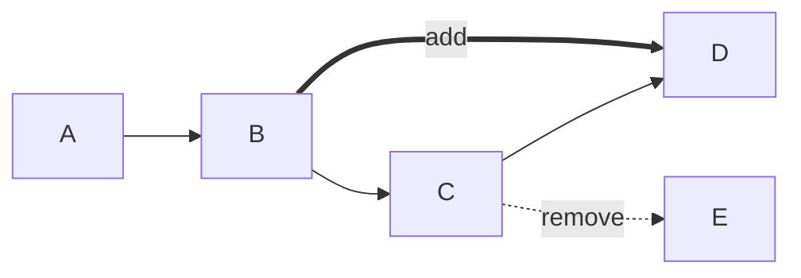

# 06_项目亮点与挑战总结

## 项目亮点总结

### 1. 渐进式重构策略

#### 风险可控的演进路径
**实施步骤**:
```text
阶段1: 数据库设计与持久化层建设
  ↓
阶段2: 认证授权与基础业务接口
  ↓  
阶段3: 异步任务执行与状态管理
  ↓
阶段4: 缓存策略与操作日志
  ↓
阶段5: 前端集成与功能验证
```

**优势分析**:
- **平滑过渡**: 每个阶段都有可验证的产出，风险分散
- **团队适应**: 逐步引入新技术栈，降低学习曲线
- **业务连续**: 保证现有功能不受影响，重构过程透明
- **快速反馈**: 每个阶段完成后都可进行测试和反馈

#### 新旧系统并存策略
- **接口层面**: `/api/*` 新接口与旧接口并存
- **数据层面**: MySQL主存储 + YAML导入导出
- **算法层面**: 保留algorithm包核心算法逻辑
- **迁移工具**: 提供YAML到MySQL的数据迁移工具

### 2. 清晰的分层架构设计

#### 四层架构职责明确
**Controller层**: 纯HTTP适配，无业务逻辑
- 参数校验与转换
- 统一响应格式
- Sa-Token注解鉴权

**AppService层**: 业务逻辑编排中心
- 聚合多个PersistenceService
- 事务边界管理
- 资源权限校验
- 业务异常处理

**Persistence层**: 数据访问抽象
- MyBatis-Plus操作封装
- 数据库异常转换
- 缓存集成接口

**Converter层**: 数据类型转换枢纽
- Entity ↔ DTO/VO 转换
- 算法模型 ↔ 数据库模型转换
- 数据脱敏与格式适配

#### 依赖注入与接口隔离
- **构造器注入**: 所有Service使用构造器注入，保证不可变性
- **接口隔离**: 每层只依赖抽象接口，不依赖具体实现
- **ObjectProvider**: 优雅处理数据库未配置情况
- **测试友好**: 便于单元测试mock依赖

### 3. 完整的异步任务链路

#### 任务执行全链路设计
**提交阶段**:
```java
@Transactional(rollbackFor = Exception.class)
public OptimizeTaskSubmitVO submitTask(CreateOptimizeTaskRequest request) {
    // 1. 创建任务记录
    getOptimizeTaskMapper().insert(task);
    
    // 2. 缓存任务状态
    optimizeTaskCacheService.cacheTaskStatus(task.getId(), OptimizeTaskStatus.PENDING);
    
    // 3. 事务提交后异步执行
    submitAfterCommit(task.getId());
    
    return OptimizeTaskConverter.toSubmitVO(task);
}
```

**执行阶段**:
```text
线程池任务 → 状态标记 → 数据加载 → 算法执行 → 结果处理 → 状态更新
```

**状态管理**:
- **PENDING**: 待执行，刚创建的任务
- **RUNNING**: 执行中，算法正在计算
- **SUCCESS**: 成功，结果已持久化
- **FAILED**: 失败，记录错误信息

#### 重试与容错机制
**重试条件**:
- 仅FAILED状态允许重试
- 重试次数不超过maxRetryCount（默认3次）
- 重试时清理旧缓存，避免脏数据

**容错设计**:
```java
private void executeTask(Long taskId) {
    try {
        markTaskRunning(taskId);
        OptimizeContext context = buildContext(taskId);
        AlgorithmOutput output = runAlgorithm(context);
        persistSuccess(context, output);
        
    } catch (Exception ex) {
        persistFailure(taskId, ex);
    }
}
```

### 4. 智能的缓存策略

#### 三级缓存架构
**会话缓存**: `satoken:login:token:{tokenValue}`
- Sa-Token默认实现
- 支持多设备登录
- 自动续期机制

**任务状态缓存**: `optimize:task:status:{taskId}`
- 实时状态查询优先缓存
- TTL 24小时，平衡性能与数据新鲜度
- 状态变更时同步更新

**优化结果缓存**: `optimize:result:{taskId}`
- 算法结果较大，缓存收益高
- 包含完整结果数据（JSON、Mermaid代码）
- 重试时清理，避免脏数据

#### 缓存一致性保障
**Cache-Aside模式**:
- 读优先缓存，未命中回源数据库
- 写先更新数据库，再删除缓存
- 最终一致性，不强求实时一致

**优雅降级**:
```java
public class RedisSafeClient {
    public Object get(String key) {
        try {
            return redisTemplate.opsForValue().get(key);
        } catch (Exception ex) {
            log.warn("Redis读取失败", ex);
            return null;  // 触发回源
        }
    }
}
```

### 5. 完善的权限安全体系

#### 认证授权一体化
**Sa-Token集成**:
- 简洁的登录/注销接口
- 注解式权限控制（@SaCheckLogin, @SaCheckRole）
- Token自动续期机制
- 多设备登录支持

**密码安全**:
```java
// BCrypt加密，每次结果不同，防止彩虹表攻击
public static String encode(String rawPassword) {
    return new BCryptPasswordEncoder().encode(rawPassword);
}
```

#### 资源权限校验链
**校验逻辑**:
```text
任意资源ID → 所属流程图 → 所属工作空间 → 所有者用户 → 当前用户
```

**统一门面**:
```java
public class ResourceAccessServiceImpl {
    public FlowGraphEntity getAccessibleGraph(Long graphId) {
        FlowGraphEntity graph = flowGraphMapper.selectById(graphId);
        getAccessibleWorkspace(graph.getWorkspaceId());  // 链式校验
        return graph;
    }
}
```

#### 操作日志审计
**日志字段**:
- 操作用户、时间、IP
- 操作类型、对象类型、对象ID
- 请求参数（脱敏后）、响应结果
- 执行耗时、成功标志

**脱敏策略**:
```java
private String maskSensitiveData(String params) {
    return params.replaceAll("\"password\":\"[^\"]*\"", "\"password\":\"******\"")
                 .replaceAll("\"token\":\"[^\"]*\"", "\"token\":\"******\"");
}
```

### 6. 算法与业务解耦设计

#### 模型分离架构
**算法模型**: ProcessMap、MultiNode、ProcessPath等
- 包含计算逻辑，频繁变化
- 不适合直接持久化
- 保持算法包的独立性

**业务模型**: Entity、DTO、VO等
- 稳定的数据库Schema
- 业务领域的抽象
- 适合持久化和查询

**转换器桥梁**:
```java
// ProcessMapConverter实现双向转换
ProcessMap processMap = ProcessMapConverter.toProcessMap(
    graph, nodes, paths, constraints, equipments
);
```

#### 执行链路封装
**AlgorithmExecutor**:
- 封装算法选择、执行、结果处理
- 统一的异常处理和状态管理
- 结果格式标准化

**结果可视化**:
- Mermaid图代码生成
- 简化版Diff结构
- 综合评分计算

## 技术挑战与解决方案

### 挑战1: 数据模型转换复杂性

#### 问题描述
算法模型（ProcessMap）与数据库模型（Entity）存在显著差异：
- 算法模型包含计算逻辑，数据库模型只存储数据
- 算法模型使用字符串关联（如equipmentName），数据库使用外键关联（equipment_id）
- 算法模型有复杂的嵌套结构，数据库需要规范化设计

#### 解决方案
**ProcessMapConverter设计**:
```java
public static ProcessMap toProcessMap(
        FlowGraphEntity graph,
        List<ProcessNodeEntity> nodes,
        List<ProcessPathEntity> paths,
        List<ConstraintConditionEntity> constraints,
        List<EquipmentEntity> equipments) {
    
    // 关键：通过equipment_id查找equipmentName
    MultiNode multiNode = new MultiNode();
    if (node.getEquipmentId() != null) {
        String equipmentName = equipments.stream()
            .filter(e -> e.getId().equals(node.getEquipmentId()))
            .findFirst()
            .map(EquipmentEntity::getName)
            .orElse(null);
        multiNode.setEquipmentName(equipmentName);
    }
    
    return processMap;
}
```

**设计原则**:
- **转换器职责单一**: 只负责数据格式转换，不包含业务逻辑
- **双向转换支持**: 支持数据库→算法和算法→数据库的双向转换
- **异常防御**: 转换失败时创建默认值，不中断流程
- **性能优化**: 批量转换，减少循环和查询

### 挑战2: 异步任务状态一致性

#### 问题描述
任务状态在多个组件间需要保持一致：
- 数据库存储最终状态
- Redis缓存实时状态
- 用户查询时状态可能正在变化
- 网络异常可能导致状态不一致

#### 解决方案
**状态机设计**:
```java
public class OptimizeTaskStateServiceImpl {
    
    public void markRunning(Long taskId) {
        // 1. 更新数据库
        OptimizeTaskEntity update = new OptimizeTaskEntity();
        update.setTaskStatus(OptimizeTaskStatus.RUNNING);
        update.setStartedAt(LocalDateTime.now());
        optimizeTaskMapper.updateById(update);
        
        // 2. 更新缓存
        optimizeTaskCacheService.cacheTaskStatus(taskId, OptimizeTaskStatus.RUNNING);
    }
}
```

**一致性策略**:
- **数据库为主**: MySQL是最终数据源，状态变更先更新数据库
- **缓存为辅**: Redis缓存当前状态，提高查询性能
- **最终一致**: 允许短暂不一致，但最终会同步
- **异常处理**: 缓存操作失败不影响主业务流程

**事务边界**:
```java
// 事务提交后才提交任务执行
private void submitAfterCommit(Long taskId) {
    if (TransactionSynchronizationManager.isActualTransactionActive()) {
        TransactionSynchronizationManager.registerSynchronization(
            new TransactionSynchronization() {
                @Override
                public void afterCommit() {
                    algorithmExecutor.submit(taskId);
                }
            }
        );
        return;
    }
    algorithmExecutor.submit(taskId);
}
```

### 挑战3: 缓存一致性保障

#### 问题描述
缓存与数据库数据可能不一致：
- 先更新缓存后更新数据库失败
- 先更新数据库后删除缓存失败
- 并发读写导致脏数据
- 缓存雪崩、击穿、穿透问题

#### 解决方案
**Cache-Aside模式**:
```text
读流程:
  1. 读取缓存
  2. 缓存命中 → 返回数据
  3. 缓存未命中 → 查询数据库 → 写入缓存 → 返回数据

写流程:
  1. 更新数据库
  2. 删除缓存
  3. 下次读取时重新加载
```

**为什么选择先更新数据库再删除缓存？**
1. **数据安全优先**: 保证数据库数据正确性最重要
2. **短暂不一致可接受**: 业务能容忍秒级的数据不一致
3. **实现简单**: 不需要复杂的分布式事务
4. **性能影响小**: 删除缓存操作很快

**降级与熔断**:
```java
public class RedisSafeClient {
    
    public Object get(String key) {
        try {
            return redisTemplate.opsForValue().get(key);
        } catch (Exception ex) {
            log.warn("Redis读取失败: key={}", key, ex);
            return null;  // 返回null触发回源
        }
    }
    
    public void set(String key, Object value, long timeout, TimeUnit unit) {
        try {
            redisTemplate.opsForValue().set(key, value, timeout, unit);
        } catch (Exception ex) {
            log.warn("Redis写入失败: key={}", key, ex);
            // 不抛出异常，允许业务继续
        }
    }
}
```

### 挑战4: 权限校验复杂度

#### 问题描述
多层资源关联导致权限校验复杂：
- 节点属于流程图，流程图属于工作空间，工作空间属于用户
- 需要校验用户是否有权访问节点
- 校验逻辑分散在各个Service中，难以维护

#### 解决方案
**统一权限校验门面**:
```java
@Service
public class ResourceAccessServiceImpl {
    
    public FlowGraphEntity getAccessibleGraph(Long graphId) {
        FlowGraphEntity graph = flowGraphMapper.selectById(graphId);
        if (graph == null) {
            throw new BusinessException(ErrorCode.RESOURCE_NOT_FOUND, "流程图不存在");
        }
        
        // 链式校验：流程图 → 工作空间 → 用户
        getAccessibleWorkspace(graph.getWorkspaceId());
        
        return graph;
    }
    
    public WorkspaceEntity getAccessibleWorkspace(Long workspaceId) {
        WorkspaceEntity workspace = workspaceMapper.selectById(workspaceId);
        
        // 管理员可访问所有，普通用户只能访问自己的
        if (!currentUserService.isAdmin()) {
            if (!workspace.getOwnerUserId().equals(currentUserService.getCurrentUserId())) {
                throw new BusinessException(ErrorCode.FORBIDDEN, "无权限访问该工作空间");
            }
        }
        
        return workspace;
    }
}
```

**设计优势**:
- **统一入口**: 所有资源访问都通过统一门面校验
- **链式校验**: 自动校验所有上级资源的权限
- **逻辑集中**: 权限校验逻辑集中在一个Service中
- **易于扩展**: 新增资源类型时只需添加对应方法

### 挑战5: 算法结果可视化

#### 问题描述
算法输出的原始结果不适合直接展示：
- 路径差异格式复杂，用户难以理解
- 指标变化需要直观展示
- 需要生成可视化流程图

#### 解决方案
**简化版Diff生成**:
```java
private Map<String, Object> buildSimplifiedDiff(Map<String, Object> pathDiff,
                                                int beforeTime,
                                                double beforePrecision,
                                                int beforeCost,
                                                int afterTime,
                                                double afterPrecision,
                                                int afterCost) {
    
    Map<String, Object> diff = new HashMap<>();
    
    // 1. 路径差异（转换为前端友好格式）
    List<Map<String, String>> addedPaths = extractPaths(pathDiff, "addPath");
    List<Map<String, String>> removedPaths = extractPaths(pathDiff, "removePath");
    diff.put("addedPaths", addedPaths);
    diff.put("removedPaths", removedPaths);
    
    // 2. 指标差异（包含变化量）
    Map<String, Object> metricDiff = new HashMap<>();
    metricDiff.put("time", metricDiffItem(beforeTime, afterTime));
    metricDiff.put("precision", metricDiffItem(beforePrecision, afterPrecision));
    metricDiff.put("cost", metricDiffItem(beforeCost, afterCost));
    diff.put("metricDiff", metricDiff);
    
    return diff;
}
```

**Mermaid可视化**:
```java
// 使用算法包的WriteMapCode生成Mermaid代码
String mapCode = Main.WriteMapCode(optimizedMap, pathDiff);
```

**生成示例**:


**综合评分计算**:
```java
private BigDecimal calculateScoreRatio(int beforeTime,
                                       double beforePrecision,
                                       int beforeCost,
                                       int afterTime,
                                       double afterPrecision,
                                       int afterCost,
                                       int[] factors) {
    
    // 权重归一化
    int sum = factors[0] + factors[1] + factors[2];
    double wTime = (double) factors[0] / sum;
    double wPrecision = (double) factors[1] / sum;
    double wCost = (double) factors[2] / sum;
    
    // 计算改进率
    double timePart = beforeTime <= 0 ? 0D : (double) (beforeTime - afterTime) / beforeTime;
    double precisionPart = afterPrecision - beforePrecision;
    double costPart = beforeCost <= 0 ? 0D : (double) (beforeCost - afterCost) / beforeCost;
    
    // 加权综合评分
    double ratio = timePart * wTime + precisionPart * wPrecision + costPart * wCost;
    
    return BigDecimal.valueOf(ratio).setScale(6, RoundingMode.HALF_UP);
}
```

## 经验教训与反思

### 1. 技术选型的权衡

#### 成功的选择
- **Spring Boot**: 快速开发，生态丰富
- **MyBatis-Plus**: 简化数据库操作，保留SQL灵活性
- **Sa-Token**: 轻量级权限框架，学习成本低
- **Redis**: 高性能缓存，支持丰富的数据结构

#### 可改进的选择
- **线程池 vs 消息队列**: 当前使用线程池处理异步任务，简单但扩展性有限。未来可考虑引入消息队列。
- **逻辑外键 vs 物理外键**: 当前使用逻辑外键，灵活但需要应用层保证一致性。核心表可考虑使用物理外键。

### 2. 架构设计的得失

#### 成功的架构决策
- **分层清晰**: 各层职责明确，便于维护和测试
- **模型分离**: 算法模型与业务模型分离，解耦彻底
- **接口隔离**: 依赖抽象接口，不依赖具体实现
- **渐进重构**: 风险可控，平滑过渡

#### 可优化的架构设计
- **缓存策略**: 当前只有基础缓存，可增加版本化缓存、热点缓存等
- **监控体系**: 只有基础健康检查，需要完善监控告警体系
- **配置管理**: 配置分散在多个地方，可考虑统一配置中心

### 3. 代码质量的提升

#### 良好的编码实践
- **统一异常处理**: 业务异常与系统异常分离
- **日志规范**: 关键操作都有日志记录
- **代码注释**: 复杂逻辑有必要的注释
- **测试覆盖**: 关键业务逻辑有单元测试

#### 需要加强的方面
- **集成测试**: 需要增加端到端的集成测试
- **性能测试**: 缺乏系统的性能测试和压测
- **安全测试**: 需要专业的安全漏洞扫描
- **代码审查**: 缺乏系统的代码审查流程

### 4. 项目管理经验

#### 有效的项目管理
- **分阶段实施**: 每个阶段都有明确目标和可验证产出
- **风险控制**: 识别关键风险并制定应对措施
- **文档完善**: 技术设计和实现都有详细文档
- **知识沉淀**: 重构过程中的经验教训有记录和总结

#### 项目管理改进
- **进度跟踪**: 需要更精细的进度跟踪和报告
- **沟通协作**: 需要更有效的团队沟通机制
- **质量保证**: 需要更严格的质量保证流程
- **变更管理**: 需要规范的变更管理流程

## 未来演进方向

### 1. 技术架构演进

#### 微服务化改造
- **服务拆分**: 按业务域拆分为用户服务、流程图服务、任务服务等
- **API网关**: 统一入口，路由、限流、鉴权
- **服务注册发现**: 使用Nacos或Consul
- **配置中心**: 统一配置管理

#### 消息队列引入
- **任务队列**: 使用RabbitMQ或Kafka处理异步任务
- **事件驱动**: 关键操作发布事件，其他服务订阅处理
- **最终一致性**: 通过消息队列保证分布式事务最终一致

### 2. 性能优化方向

#### 缓存策略优化
- **版本化缓存**: 流程图按版本缓存，支持历史版本查询
- **热点缓存**: 识别热点数据，预加载到缓存
- **缓存预热**: 系统启动时预加载常用数据
- **缓存监控**: 详细的缓存命中率、内存使用监控

#### 数据库优化
- **读写分离**: 主库写，从库读，提高查询性能
- **分库分表**: 按workspace_id分库，按时间分表
- **SQL优化**: 持续优化慢查询，添加必要索引
- **连接池优化**: 根据实际负载调整连接池参数

### 3. 功能扩展规划

#### 算法能力扩展
- **新算法集成**: 支持更多优化算法
- **算法组合**: 支持多个算法组合使用
- **参数调优**: 自动调参，寻找最优参数组合
- **算法评估**: 多维度算法效果评估

#### 可视化增强
- **实时流程图**: 实时展示算法执行过程
- **交互式图表**: 交互式展示优化结果
- **3D可视化**: 复杂流程的3D可视化展示
- **移动端适配**: 移动端友好的可视化界面

### 4. 运维监控完善

#### 监控告警体系
- **应用监控**: JVM、线程池、接口性能
- **业务监控**: 关键业务指标监控
- **日志分析**: 集中日志收集和分析
- **告警策略**: 分级告警，智能推送

#### DevOps实践
- **CI/CD**: 自动化构建、测试、部署
- **容器化**: Docker容器化部署
- **Kubernetes**: 容器编排和管理
- **灰度发布**: 渐进式发布，降低风险

## 总结

这个项目不仅是一次技术重构，更是一次完整的工程实践。通过这个项目：

1. **验证了渐进式重构的可行性**: 在不中断业务的前提下完成架构升级
2. **实践了分层架构的最佳实践**: 清晰的分层，明确的职责，良好的扩展性
3. **解决了分布式系统的核心问题**: 异步任务、缓存一致性、权限安全等
4. **积累了丰富的技术经验**: 从架构设计到代码实现，从性能优化到运维监控

项目的成功不仅体现在技术的实现，更体现在解决实际业务问题的能力。这个项目为未来的技术发展和职业成长奠定了坚实的基础。